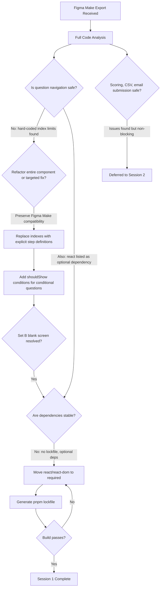
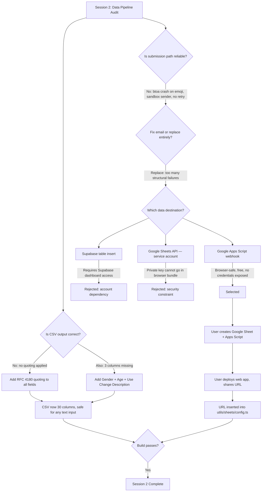

# Wardrobe Mirror — Project Context & Workflow Overview

## What This Tool Is

Wardrobe Mirror is a mobile-first research diagnostic tool. It guides participants through three structured question sets about their clothing — a recent purchase, a favourite garment, and a garment they are ready to dispose of. At the end, their responses are scored and mapped to a behavioural archetype (persona), and the data is automatically submitted to the researcher.

The tool was designed to collect structured qualitative and quantitative data about wardrobe behaviour at scale, without requiring in-person interviews.

---

## Core Tech Stack

**Figma Make** — Figma's tool for turning UI designs directly into deployable web apps. It exports a working codebase that can be edited, built, and hosted. The Wardrobe Mirror was created and is deployed through Figma Make.

**Vite + React + TypeScript** — The underlying framework. Vite is the build tool (compiles the code into files a browser can run). React is the UI framework. TypeScript is a typed version of JavaScript that catches errors before the app runs.

**Supabase** — A backend platform used in the original version of the app. Provided a server (Edge Function) that received data from the browser and sent it by email to the researcher.

**Google Apps Script** — Google's scripting platform built into Google Workspace. Used in the current version to receive data from the browser and write it directly to a Google Sheet row by row.

---

## Data Flow — How Research Data Moves

When a participant completes the questionnaire, the following happens automatically:

```
Participant answers questions
        ↓
App scores responses + assigns persona
        ↓
App formats data as rows (30 fields per set)
        ↓
App sends data to Google Apps Script endpoint
        ↓
Apps Script appends one row per completed set to the Google Sheet
        ↓
Researcher opens Google Sheet to view all submissions
```

If the submission to Google Sheets fails for any reason, the app automatically downloads the data as local CSV and JSON files as a fallback.

---

## Codex: Session 1 — Initial Analysis and Stabilisation

*This section documents the work done in the session prior to the current one, based on the original notes in this folder.*

### Starting Point

The app was exported from Figma Make as a working prototype. The core logic — all question rendering, state management, scoring, export, and submission — lived in a single large file: `MirrorGame.tsx` (~1600 lines). While functional in appearance, a detailed analysis revealed it was not safe to use in a real research context.

### Critical Problems Found

**1. Participants could get permanently stuck**
The app used hard-coded numbers to decide when a question set was complete (e.g. "if question index is less than 11, keep going"). This broke whenever a conditional question was skipped. The concrete failure: in Set B, if a participant answered "No" to "Has its use changed over time?", the app tried to advance to a question that only exists when the answer is "Yes". The result was a blank screen with no way forward.

**2. Navigation controls appeared at the wrong times**
The Continue button for the optional "What is the brand?" question in Set B was checked against the wrong index, meaning it could appear too early or not function correctly.

**3. State changes happened during rendering**
In React, changing the app's state during the render process is unsafe — it can cause the screen to flicker, repeat actions, or behave unpredictably. The app was completing entire question sets from inside its render logic rather than from user interaction handlers.

**4. The project could not be reliably installed**
`react` and `react-dom` — the two core packages the app depends on — were listed as optional rather than required. A fresh install on a new machine might not include them, breaking the build. There was also no lockfile, meaning installs could produce different package versions each time.

### What Was Fixed

The stabilisation pass replaced the hard-coded navigation numbers with an explicit step definition system. Each question in each set was given:
- A stable ID
- A render position
- An optional `shouldShow` condition for conditional questions

The Continue and Back buttons were updated to navigate through only the *visible* steps for the current answers, skipping any questions whose conditions weren't met. This made the flow safe regardless of what the participant answered.

The Set B blank screen bug was resolved. State changes were moved out of the render function and into the correct interaction handlers. `react` and `react-dom` were moved to required dependencies and a lockfile was generated.

### What Was Intentionally Left Alone

The stabilisation pass did not touch: scoring logic, CSV export, email submission, visual design, or question content. These were deferred to the next session.

---

## Session 2 — Data Quality and Submission Overhaul

### Starting Point

With the questionnaire flow stable, the second session focused on what happens *after* a participant finishes — specifically how the data is formatted and where it goes.

### Problems Found in the Data Pipeline

**CSV corruption**
The app generated a CSV file by joining all values with commas. No quoting or escaping was applied. If any participant typed a comma inside a free-text answer (e.g. a brand name like "Nike, Jordan"), that comma would be treated as a column separator — silently splitting one answer across two columns. Every column after it in that row would shift, corrupting the researcher's dataset with no error or warning.

**Missing data in the CSV**
Three fields collected by the app never appeared in the CSV output:
- `Gender` — collected in the baseline questions, absent from the CSV
- `Age` — collected in the baseline questions, absent from the CSV
- `Use Change Description` — a free-text field in Set B asking how the garment's use had changed, absent from the CSV

The JSON export was complete. The CSV was not. A researcher relying solely on the CSV for analysis would be missing demographic data entirely.

**Email submission was unreliable**
The original submission path sent data via email using a Supabase Edge Function and the Resend email service. Three separate failure modes were identified:
1. If any participant typed an emoji or non-standard character in a text field, the encoding function (`btoa`) would crash the server, silently discarding the submission
2. The sender email address (`onboarding@resend.dev`) was Resend's test-only domain — not suitable for production delivery
3. A single failed attempt had no retry, and the fallback required the participant to manually email files to the researcher

### Decision: Replace Email with Google Sheets

After evaluating several options (Supabase database, Google Sheets API, Google Apps Script), the team moved to a **Google Apps Script webhook** approach. Key reasons:
- Removes the Supabase account dependency entirely
- No credentials or private keys in the browser bundle
- The researcher owns the data directly in a Google Sheet they control
- Compatible with the Figma Make deployment without any structural changes
- Free, with no billing or API quota concerns at research-tool scale
- The user already had the Google Sheets API enabled in Google Cloud Console

### What Was Built

A Google Apps Script was deployed as a web app under the researcher's Google account. It receives a POST request from the browser at the end of each completed session and appends one row per completed question set to the `Responses` sheet.

On the code side:
- A shared `buildResponseRow()` function was created to construct the 30-column data row for each set type (A, B, C)
- `generateCSVString()` was updated to use RFC 4180 quoting — wrapping any value containing commas, quotes, or line breaks in double quotes
- `Gender`, `Age`, and `Use Change Description` columns were added to the CSV output (now 30 columns, up from 27)
- `emailDataToResearcher()` was replaced by `submitToGoogleSheets()`, which POSTs the row data to the Apps Script URL
- A new config file `utils/sheets/config.ts` holds the Apps Script deployment URL
- The local download fallback (CSV + JSON files) was kept as a safety net

### Build Verification

The production build passed:
```
✓ 1602 modules transformed.
✓ built in 3m 42s
```
Output: `dist/index.html`, bundled CSS, bundled JS, and the config file as a separate chunk.

---

## Current State of the Repo

| Area | Status |
|---|---|
| Question navigation (Sets A, B, C) | Fixed — stable step-based system |
| Set B blank screen bug | Fixed |
| CSV quoting | Fixed — RFC 4180 compliant |
| Missing CSV columns (Gender, Age, Use Change Description) | Fixed — 30 columns |
| Data submission | Fixed — Google Sheets via Apps Script |
| Emoji/non-ASCII crash | Resolved — Apps Script handles UTF-8 natively |
| Supabase dependency | Removed from frontend |
| Build and install readiness | Stable — lockfile present, dependencies correct |

---

## Known Deferred Issues

These were identified but intentionally left out of scope across both sessions:

- **Scoring mismatches** — The values stored for some answers (e.g. repair type, use change) do not match what the scoring function checks. Persona scores for those behaviours never increment correctly.
- **Component decomposition** — `MirrorGame.tsx` remains a single large file. A future refactor could split it into logical modules for easier maintenance.

---

## File Reference

| File | Role |
|---|---|
| `src/app/components/mirror/MirrorGame.tsx` | All question logic, scoring, UI, and submission |
| `src/app/styles/wardrobe-mirror.css` | Visual design system |
| `utils/sheets/config.ts` | Google Apps Script deployment URL |
| `supabase/functions/server/index.tsx` | Original email server — no longer called |
| `Notes/core-issues-context.md` | Session 1 issue analysis |
| `Notes/stabilization-plan-and-changes.md` | Session 1 plan and implementation record |
| `Notes/prompts-used.md` | Session 1 prompt log |
| `Notes/gemini-handoff.md` | Technical handoff document for continued development |

---

## Decision Trees

### Session 1 — Navigation and Build Stabilisation



---

### Session 2 — Data Quality and Submission Overhaul



---

## Planning Approach: Session 1 vs Session 2

### Session 1 — Codex Planning (Prior AI Session)

The first session was conducted with a different AI model before the current workflow began. The planning approach was reactive — issues were identified through analysis, a scoped plan was written, reviewed by the user, and then implemented. The scope was deliberately narrow: fix what stops the app from working, touch nothing else.

The key planning decision was to reject a full architectural refactor in favour of a targeted fix. This preserved the Figma Make file structure and kept the risk of introducing new problems low. The plan was written, explained to the user in plain terms, approved, then executed. Scoring, CSV, and email were explicitly marked out of scope and documented for the next session.

### Session 2 — Claude Planning (Current Session)

The planning approach followed a structured sequence: analyse first, evaluate options, propose a plan with clear reasoning, get approval, then implement. No code was written until the plan was reviewed.

The core planning decision in this session was not just *how* to fix the data pipeline, but *whether* to fix the existing path or replace it entirely. Multiple options were evaluated openly — Supabase table insert, Google Sheets API via service account, Google Apps Script, fixing the Resend email path — with trade-offs stated for each before a recommendation was made. The user retained decision-making authority throughout.

Once a direction was chosen, the plan was written as a formal document before implementation began, covering: what changes would be made, what files would be touched, what the user needed to do on their side, and how to verify the result.

---

## User Workflow: Google Apps Script Setup

This section documents the human-in-the-loop steps completed by the user that connected the code changes to live Google infrastructure.

**What the user did:**
1. Opened Google Sheets and created a new spreadsheet named `Wardrobe Mirror Research`
2. Renamed the default tab to `Responses` and pasted the 30 column headers into row 1
3. Opened the Apps Script editor via Extensions → Apps Script
4. Pasted the provided `doPost` function and saved the project
5. Deployed the script as a web app with access set to Anyone
6. Authorized the script to write to their Google Sheet
7. Copied the deployment URL and shared it
8. That URL was inserted into `utils/sheets/config.ts` — completing the connection

**Why this division of work mattered:**
The code changes handled everything the browser needed to do — building the data rows, quoting the CSV correctly, calling the right URL. The Apps Script setup handled everything on Google's side — receiving the data, authenticating against the sheet, writing the rows. Neither half worked without the other. The user's setup steps were not optional configuration; they were a required half of the integration.

---

## Why the Workflow Process Worked

This section examines why the two-session, human-AI collaborative process successfully resolved challenges that had persisted undetected in the original build.

### Structured analysis before any action

Both sessions began with a full read of the codebase before a single line was changed. This is not the default behaviour in most development workflows, especially when working under time pressure. In Session 1, this analysis revealed four distinct failure modes that were not visible from looking at the app in the browser. In Session 2, it revealed that the data the app was collecting was not the data the researcher was receiving — a silent discrepancy that could have affected research conclusions.

### Explicit scoping prevented scope creep

Each session had a written boundary around what would and would not be changed. This is what allowed Session 1 to be completed cleanly and what prevented Session 2 from becoming an unbounded refactor. Decisions about what to defer were documented, not forgotten.

### Options were evaluated before committing

The Google Sheets decision is the clearest example. Rather than immediately implementing the first viable path (fixing the existing email), four options were evaluated against the specific constraints of this project. The chosen option (Apps Script) emerged from that evaluation, not from assumption. This produced a better outcome — no Supabase dependency, no credentials in the browser, no billing risk.

### Human decision-making was preserved at every fork

The AI handled analysis, planning, and implementation. The user made every significant decision — what to fix, what to defer, which direction to take, whether to proceed. This is what makes the outcome reproducible and trustworthy: the researcher knows exactly why each choice was made because they made it.

### The user's Google setup completed the loop

The final integration required something no AI model could do: authenticating with a real Google account, authorising a script to write to a real spreadsheet, and copying a live deployment URL. This human step was not a gap in the workflow — it was the point where the user's ownership of the data infrastructure was established. The data now flows into a sheet the researcher controls directly, not through a third-party service someone else manages.

---

## Why These Issues Existed When Working Only in Figma Make

Figma Make is an exceptional environment for turning design intent into a working visual prototype rapidly. It is not, however, a production code review environment. The issues found in this project are characteristic of what happens when code generated in that context is moved into active use without a review step.

**Generated code is optimised for visual output, not behavioural safety.**
Figma Make produces code that renders correctly and looks right in the browser. Conditional navigation logic — the kind that needs to handle every possible combination of answers — is significantly harder to generate correctly than layout or styling. The hard-coded index navigation was not a mistake in the usual sense; it was a reasonable approximation that held up under straightforward use but failed under specific answer combinations.

**Infrastructure integrations are set up for demonstration, not production.**
The Supabase Edge Function and Resend email path were configured to show that data submission worked — which it did, under ideal conditions. The `btoa` encoding limitation, the sandbox sender domain, and the absence of retry logic are all characteristics of a proof-of-concept integration. They are not failures of the tool; they are the natural boundary of what Figma Make is designed to produce.

**There is no code review step inside Figma Make.**
When a designer works entirely within Figma Make, the feedback loop is visual: does it look right, does clicking through it feel right? There is no equivalent prompt for: does the data reach the researcher correctly if the user types a comma, an emoji, or answers "No" to a conditional question? That class of question only becomes visible when the code is read as code — which is precisely what the analysis sessions did.

**The result is not a criticism of Figma Make.**
It is an argument for treating Figma Make exports as a strong first draft rather than a finished product — and for building a structured review step into the workflow before deployment to real participants.

---

## Going Forward

- **Export is not deployment.** A Figma Make export that runs in the browser is a prototype, not a production-ready tool. A structured code review should precede any real participant-facing deployment.
- **Data quality is invisible until you look for it.** The CSV had been generating corrupted output and missing columns since the tool was built. Nothing in the user-facing experience indicated this.
- **Scoped sessions outperform open-ended ones.** Both sessions delivered clean outcomes because each had a written boundary. Work without a defined scope tends to expand until something breaks.
- **Human-AI collaboration works best when roles are clear.** AI handles analysis and implementation. Humans handle decisions and external service authorisation. Neither replaces the other.
- **The strongest validation is a real test.** The build passing confirms the code compiles. Only completing a full run and checking the Google Sheet confirms the data flow works end to end.
